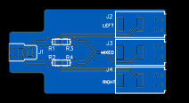
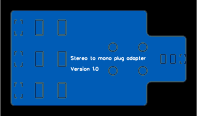

# Stereo to mono plug adapter

A small board with a male stereo 3.5mm (TRS) plug on one side and three mono 3.5mm (TS) sockets on the other side. The three mono sockets are connected to:

* Left channel
* 50%/50% mix of left and right channels
* Right channel

TODO: Add photo of completed board

## Licence

Copyright © 2024 Phil Baldwin

This work is licensed under a Creative Commons Attribution-ShareAlike 4.0 International License.

You should have received a copy of the license along with this work. If not, see <http://creativecommons.org/licenses/by-sa/4.0/>.
